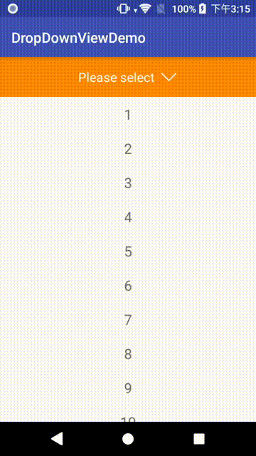

# DropDownView

A flexibly **configurable**, beautifully **animated**, device-**rotatable** drop down list widget.

<p>

</p>

## Usage

Minimum SDK: 16 

### Add to Project

First make sure `jcenter()` is included as a repository in your **project**'s build.gradle:  

```groovy
allprojects {
    repositories {
        jcenter()
    }
}
```

And then add the below to your app's build.gradle:  

```groovy
    implementation 'com.asksira.android:dropdownview:1.0.3'
```

### Step 1: Create DropDownView in XML

```xml
    <com.asksira.dropdownview.DropDownView
        android:id="@+id/dropdownview"
        android:layout_width="match_parent"
        android:layout_height="match_parent"
        app:placeholder_text="Please select"
        app:dropdownItem_text_gravity="start"
        app:dropdownItem_compound_drawable_selected="@drawable/ic_done_black_24dp"
        app:filter_bar_background_color="@android:color/holo_orange_dark"
        app:filter_text_color="@android:color/white"
        app:arrow_drawable="@drawable/expand_arrow"
        app:arrow_width="24dp"
        app:dropDownItem_text_color_selected="@android:color/holo_orange_dark"
        app:divider_color="@android:color/holo_orange_light"
        app:dropDownItem_text_size_selected="18sp"
        app:bottom_decorator_color="@android:color/holo_orange_dark"
        app:bottom_decorator_height="4dp"
        app:expansion_style="drawer"
        app:last_item_has_divider="false"/>
```

**IMPORTANT**:  
The size of `DropDownView` includes both the filter bar **AND** the drop down list, as well as the background dim.  
Therefore its size is meant to be extended to the bottom of its parent.  
Therefore it should be placed on top of other views, in a `RelativeLayout` / `FrameLayout` / `ConstraintLayout`.
Note that the opened drop down list is scrollable, so you don't need to worry even if you have a lot of selectable items.

| Attribute Name                         | Type        | Unit  | Default             | Remarks                                                        |
|----------------------------------------|-------------|-------|---------------------|----------------------------------------------------------------|
| filter_height                          | Dimension   | dp    | 56dp                |                                                                |
| filter_text_size                       | Dimension   | dp/sp | 18sp                |                                                                |
| filter_text_color                      | Resource ID | N/A   | #212121             |                                                                |
| filter_bar_background_color            | Resource ID | N/A   | Transparent         |                                                                |
| filter_text_arrow_padding              | Dimension   | dp    | 8dp                 |                                                                |
| arrow_width                            | Dimension   | dp    | wrap_content        |                                                                |
| arrow_height                           | Dimension   | dp    | match_parent        | match_parent means same as filter bar height.                  |
| arrow_drawable                         | Resource ID | N/A   | Default arrow       | Default is a black arrow from material design                  |
| arrow_rotate                           | boolean     | N/A   | true                | The boolean stands for whether to animate.                     |
| divider_height                         | Dimension   | dp    | 1dp                 |                                                                |
| divider_color                          | Resource ID | N/A   | #BDBDBD             |                                                                |
| dropDownItem_height                    | Dimension   | dp    | 48dp                |                                                                |
| dropDownItem_text_size                 | Dimension   | dp/sp | 16sp                |                                                                |
| dropDownItem_text_size_selected        | Dimension   | dp/sp | 16sp                |                                                                |
| dropDownItem_text_color                | Resource ID | N/A   | #212121             |                                                                |
| dropDownItem_text_color_selected       | Resource ID | N/A   | #212121             |                                                                |
| dropDownItem_background_color          | Resource ID | N/A   | #FFFFFF             |                                                                |
| dropDownItem_background_color_selected | Resource ID | N/A   | #FFFFFF             |                                                                |
| expand_dim_background                  | boolean     | N/A   | true                |                                                                |
| dim_background_color                   | Resource ID | N/A   | #80000000           |                                                                |
| expand_include_selected_item           | boolean     | N/A   | true                | Whether the drop down list includes the already selected item. |
| placeholder_text                       | String      | N/A   | Empty               |                                                                |
| dropdown_typeface                      | Resource ID | N/A   | Default system font | More information below                                         |
| dropdown_animation_duration            | int         | ms    | 300                 |                                                                |
| dropdownItem_text_gravity              | enum        | N/A   | center_horizontal   | center_horizontal / start / end                                |
| dropdownItem_compound_drawable_selected| Resource ID | N/A   | null                | An image that is displayed at the end of the dropdown item.    |
| top_decorator_height                   | Dimension   | dp    | 0                   |                                                                |
| top_decorator_color                    | Resource ID | N/A   | Transparent         |                                                                |
| bottom_decorator_height                | Dimension   | dp    | 0                   |                                                                |
| bottom_decorator_color                 | Resource ID | N/A   | Transparent         |                                                                |
| expansion_style                        | enum        | N/A   | drawer              | drawer / reveal                                                |
| last_item_has_divider                  | boolean     | N/A   | true                |                                                                |

For the typeface (font), you must use the [Official font resource published together with support library v26](https://developer.android.com/guide/topics/ui/look-and-feel/fonts-in-xml.html). i.e. the xml should be something like `app:dropdown_typeface="@font/my_own_typeface"`

### Step 2: Setup in Activity / Fragment

You should
1. Provide selectable items (`List<String>`) to DropDownView
2. Set `OnSelectionListener` to DropDownView

```java
public class MainActivity extends AppCompatActivity {

    DropDownView dropDownView;
    List<String> yourFilterList;

    @Override
    protected void onCreate(Bundle savedInstanceState) {
        //...
        dropDownView = findViewById(R.id.dropdownview);

        dropDownView.setDropDownListItem(yourFilterList);
        dropDownView.setOnSelectionListener(new OnDropDownSelectionListener() {
            @Override
            public void onItemSelected(DropDownView view, int position) {
                //Do something with the selected position
            }
        });
    }
}
```

If you are using Kotlin, `setOnSelectionListener` should be like this:
```kotlin
        dropDownView.onSelectionListener = OnDropDownSelectionListener { view, position ->
            //...
        }
```

That's it!

### Available public methods

```java
    dropDownView.expand(boolean animated);
    dropDownView.collapse(boolean animated);
    dropDownView.toggle(boolean animated);

    /**
     * Below are views that opens get method to you.
     * You can get them and change whatever you like.
     */
    dropDownView.getFilterContainer();
    dropDownView.getFilterTextView();
    dropDownView.getFilterArrow();
    dropDownView.getBackgroundDimView();


    /**
     * Functional methods
     */
    dropDownView.getSelectingPosition(); //Return -1 if nothing is selected
    dropDownView.setSelectingPosition(int selectingPosition); //Select item programmtically. OnSelectionListener will be triggered as well.


    /**
     * View configurations
     */
    dropDownView.setFilterHeight(float px);
    dropDownView.setTextSize(float px);
    dropDownView.setFilterTextColor(int colorResourceID);
    dropDownView.setFilterBarBackgroundColor(int colorResourceID);
    dropDownView.setArrowDrawableResId(int drawableResId);
    dropDownView.setArrowRotate(boolean yes);
    dropDownView.setDividerHeight(float px);
    dropDownView.setDividerColor(int colorResourceID) ;
    dropDownView.setDropDownItemHeight(float px);
    dropDownView.setDropDownItemTextSize(float px);
    dropDownView.setDropDownItemTextColor(int colorResourceID);
    dropDownView.setDropDownItemTextColorSelected(int colorResourceID);
    dropDownView.setDropDownBackgroundColor(int colorResourceID);
    dropDownView.setExpandDimBackground(boolean yes);
    dropDownView.setExpandIncludeSelectedItem(boolean yes);
    dropDownView.setPlaceholderText(String placeholderText);
    dropDownView.setTypeface(int fontResourceId);
    dropDownView.setAnimationDuration(int ms);
    dropDownView.setFilterTextArrowPadding(float px);
    dropDownView.setArrowWidth(float px);
    dropDownView.setArrowHeight(float px);
    dropDownView.setDropDownItemTextSizeSelected(float px);
    dropDownView.setDropDownBackgroundColorSelected(int colorResourceID);
    dropDownView.setDimBackgroundColor(int colorResourceID);
    dropDownView.setDropdownItemGravity(int gravity);
    dropDownView.setDropdownItemCompoundDrawable(int drawableResId);
    dropDownView.setTopDecoratorColor(int colorResourceID);
    dropDownView.setTopDecoratorHeight(float px);
    dropDownView.setBottomDecoratorColor(int colorResourceID);
    dropDownView.setBottomDecoratorHeight(float px);
    dropDownView.setExpansionStyle(DropDownView.REVEAL);
    dropDownView.setLastItemHasDivider(false);
```

### Tips

- In case you don't want to show an arrow, just set `filter_text_arrow_padding` and `arrow_width` both to 0dp.

### Customize your own DropDownItems

You can extends DropDownView and override `View generateDropDownItem(String itemName, int index)` to provide your implementation. It works as long as you return a View.  
But be aware that you need to do the below things when you override:

1. Do not call super.generateDropDownItem (Ya of coz)
2. Your view should have `LayoutParams` as `new LinearLayout.LayoutParams(MATCH_PARENT, theHeightYouWishToHaveInPixel)`
3. You should set onClickListener by yourself. To be exact, call `setSelectingPosition(index)` in the `OnClickListener`.

## Limitations

1. Drop down list must have the same width as filter bar.
2. Supports only single selection. (May consider adding multiple selection in the future releases)

## Known Issues

1. If your have a lot of drop down items and `expansion_style="drawer"`(default), items are not scrollable. Looks like this is a limitation of Android framework itself where a `LinearLayout` in a `ScrollView` with `layout_gravity="bottom"` cannot be scollred. So I suggest you use `expansion_style="reveal"` if you have a lot of drop down items.

## Release notes

v1.0.3
1. Exposed some more views.

v1.0.2
1. Fixed Issue #3.

v1.0.1
1. Converted to Kotlin.
2. Solved Issue #2.
3. Added Top and Bottom Decorator.
4. Allow configuration of drop down items' gravity.
5. Allow configuration of selected item's compound drawable.
6. Allow configuration of expansion style.
7. Allow configuration of last item has divider or not.
8. Allow overriding `View generateDropDownItem(String itemName, int index)` to customize drop down items.

v0.9.1  
First Release.

## License

```
Copyright 2018 Sira Lam

Licensed under the Apache License, Version 2.0 (the "License");
you may not use this file except in compliance with the License.
You may obtain a copy of the License at

    http://www.apache.org/licenses/LICENSE-2.0

Unless required by applicable law or agreed to in writing, software
distributed under the License is distributed on an "AS IS" BASIS,
WITHOUT WARRANTIES OR CONDITIONS OF ANY KIND, either express or implied.
See the License for the specific language governing permissions and
limitations under the License.
```